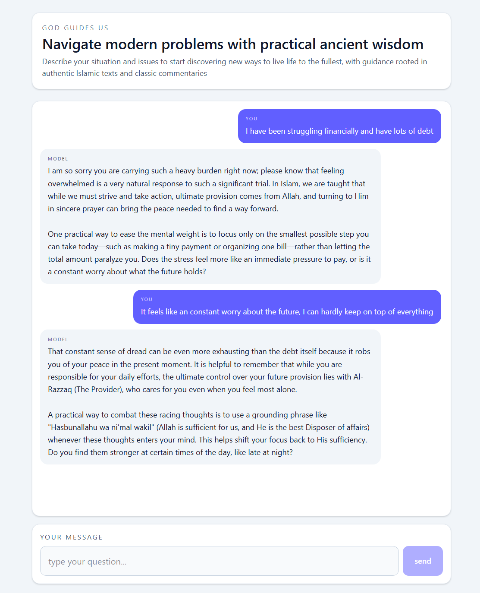

# GodGuidesUs 🕊️

A Retrieval Augmented Generation (RAG) platform providing spiritual guidance grounded in Islamic scripture

Initially built for HackUPC in Barcelona. Check it out at [godguides.us](https://godguides.us)

## Overview
GodGuidesUs is an AI powered assistant designed to provide practical insights to help guide you. Unlike standard AI, this application uses RAG to ensure every response is anchored in authentic texts and classical commentary  stored in a dedicated knowledge base

## Tech Stack
*   **Frontend:** React + Vite (TypeScript)
*   **Backend:** .NET Web API
*   **Database:** MongoDB Atlas (Vector Search)
*   **AI Models:** 
    *   `text-embedding-004` (Google Gemini) for vectorisation
    *   `gemma-4-26b-a4b-it` for response generation
*   **Deployment:** Vercel (Frontend) & Render (Backend / Docker)

## Approach
The application follows a modern RAG architecture to provide grounded answers semantically relevant to the user:

1.  **Vectorisation:** When a user asks a question, the .NET backend sends the text to Google's embedding model to generate a high dimensional vector representation
2.  **Context Retrieval:** The backend performs a **Vector Search** against a MongoDB Atlas collection where thousands of categorised Quran verses with connected commentary (Tafsir) were uploaded programmatically 
3.  **Prompt Augmentation:** The most relevant verses are retrieved and injected into a specialised "system prompt"
4.  **Inference:** The augmented prompt is sent to Gemma 4, which generates a response that synthesises the user's intent with the provided context. This model is now open source enabling potential for more private insights
5.  **Streaming:** The response is delivered back to the React frontend for a seamless user experience

Quranic verses and commentary sourced from https://github.com/spa5k/tafsir_api 

